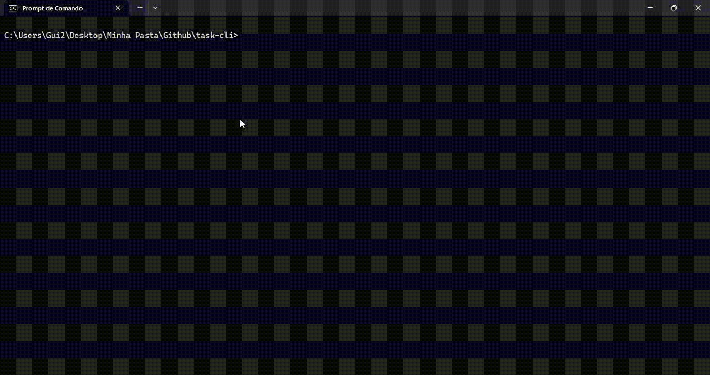

# Projeto Task-Cli

O task-cli é um projeto de linha de comando feito para ajudar na organização e controle de suas tarefas diárias.

URL do Projeto: https://roadmap.sh/projects/task-tracker

## Demonstração



## Instalação

Para fazer o deploy desse projeto cópie e cole os seguintes comandos em seu terminal.

**1 - Clone o repositório;**
```bash
    git clone https://github.com/guilhermegodoydev/task-cli.git

    cd task-cli
```

**2 - Instale as dependências (se necessário);**
```bash
    npm install
    npm link
``` 

**3 - Rode o CLI**
```bash
    node index.js <comando> [argumentos]
```


## Comandos disponíveis

- `help`: Exibir os comandos disponíveis.
- `add <taskDescription>`: Adicionar uma nova tarefa.
- `update <taskId> <newTaskDescription>`: Atualizar uma tarefa existente.
- `delete <taskId>`: Deletar uma tarefa.
- `mark-in-progress <taskId>`: Marcar uma tarefa como em andamento.
- `mark-done <taskId>`: Marcar uma tarefa como concluída.
- `list [status]`: Listar tarefas, opcionalmente filtradas pelo status (`todo`, `in-progress`, `done`).

## Uso/Exemplos

- Add a task:
    ```bash
    node index.js add "Comprar mantimentos"
    ```

- Update a task:
    ```bash
    node index.js update 1 "Comprar mantimentos e preparar o jantar"
    ```

- Delete a task:
    ```bash
    node index.js delete 1
    ```

- Mark a task as in-progress:
    ```bash
    node index.js mark-in-progress 1
    ```

- Mark a task as done:
    ```bash
    node index.js mark-done 1
    ```

- List all tasks:
    ```bash
    node index.js list
    ```

- List tasks with a specific status:
    ```bash
    node index.js list done
    ```


## Stack utilizada

Node.js
